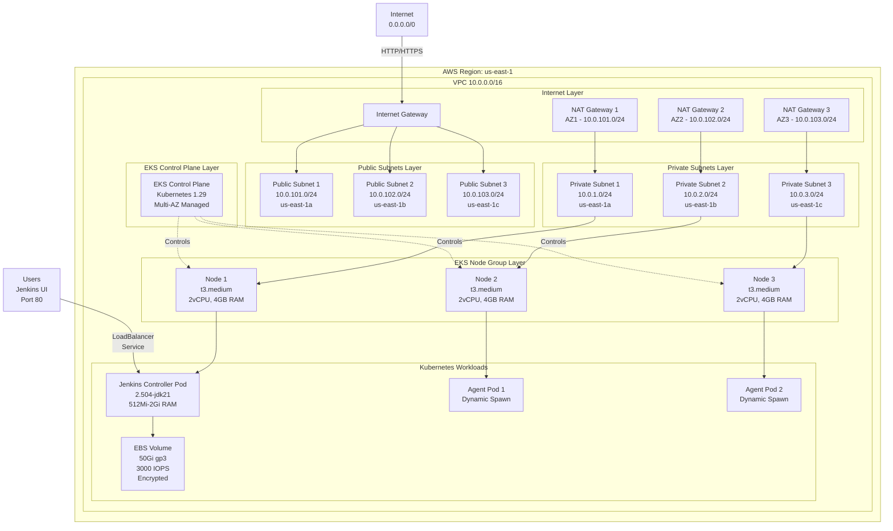
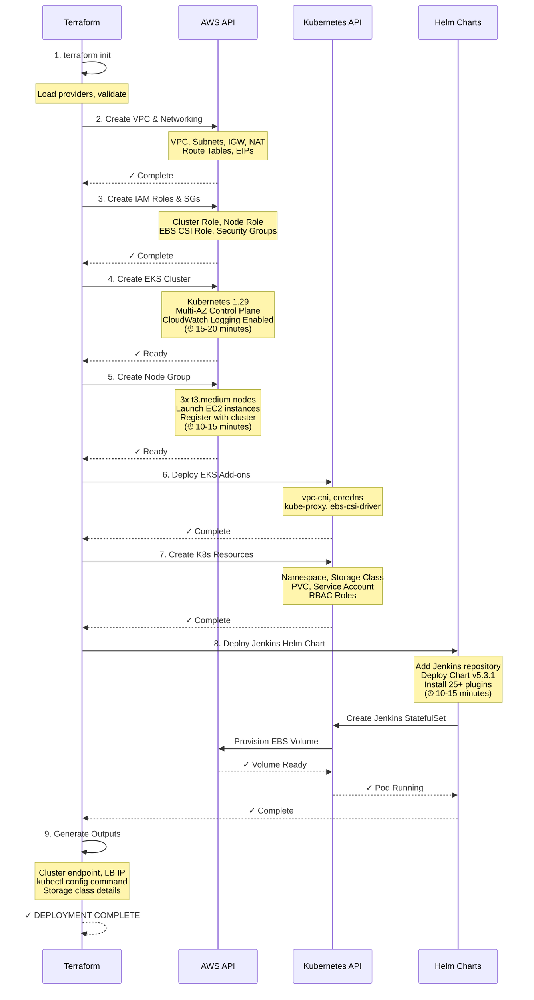
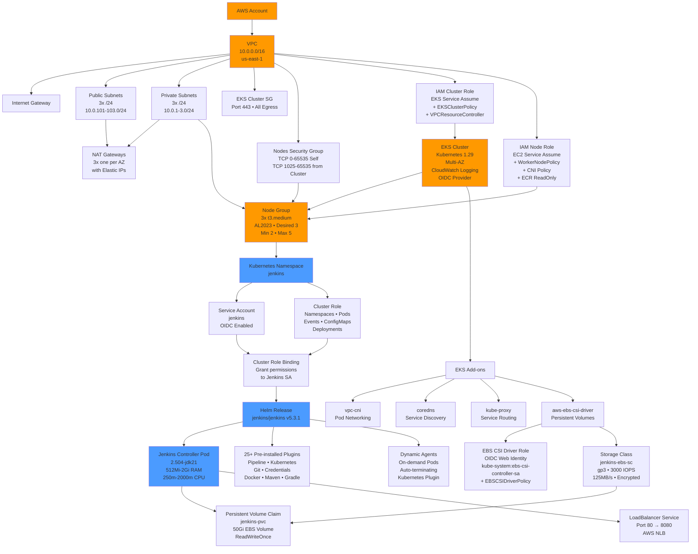
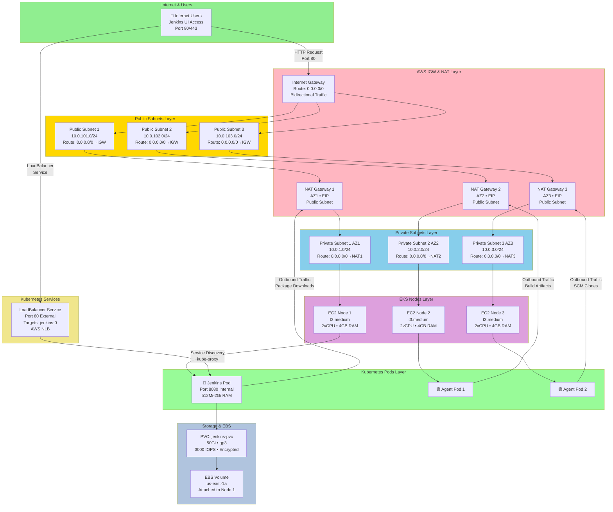
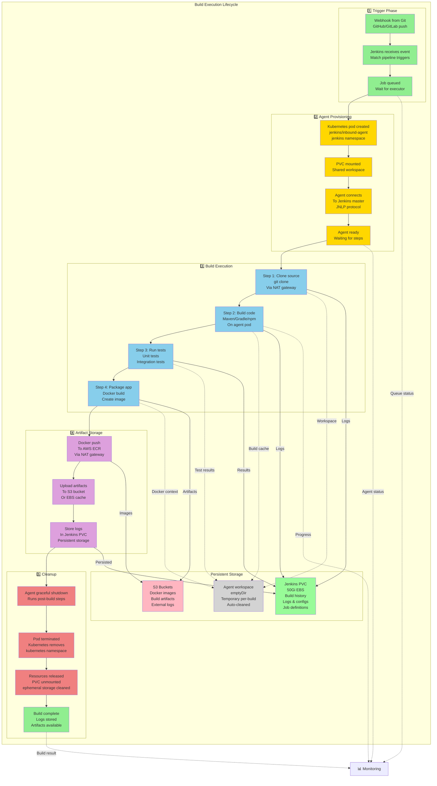

# Jenkins on AWS EKS - Detailed Project Documentation

## Table of Contents
1. [Project Overview](#project-overview)
2. [Architecture & Workflow Diagrams](#architecture--workflow-diagrams)
3. [Networking Architecture](#networking-architecture)
4. [Infrastructure Resources](#infrastructure-resources)
5. [Deployment Workflow](#deployment-workflow)
6. [Security & Access](#security--access)
7. [Configuration Details](#configuration-details)
8. [Deployment Instructions](#deployment-instructions)

---

## Project Overview

### Purpose
This Terraform project automates the complete infrastructure setup for **Jenkins CI/CD on AWS EKS (Elastic Kubernetes Service)**. It creates a production-ready Kubernetes cluster with Jenkins pre-installed and configured for continuous integration and continuous deployment workflows.

### Key Features
- **Fully Automated**: Infrastructure-as-Code using Terraform
- **High Availability**: Multi-AZ deployment across 3 Availability Zones
- **Scalable**: Auto-scaling EKS node groups (2-5 nodes)
- **Persistent Storage**: EBS-backed persistent volumes for Jenkins data
- **Secure**: VPC isolation, security groups, RBAC, and OIDC integration
- **Load Balanced**: LoadBalancer service for Jenkins UI access
- **Enterprise Plugins**: Pre-installed plugins for Git, Docker, Kubernetes, Pipeline, and Build tools

### Technology Stack
| Component | Version |
|-----------|---------|
| AWS Provider | ~5.0 |
| Terraform | ≥1.0 |
| Kubernetes Provider | ~2.0 |
| Helm Provider | ~2.0 |
| EKS Cluster | 1.29 |
| Jenkins (Helm Chart) | 5.3.1 |
| Jenkins Controller | 2.504-jdk21 |

### Project Structure
```
.
├── main.tf                           # Provider configuration, backend setup
├── variables.tf                      # Input variable definitions
├── terraform.tfvars                  # Variable values
├── vpc.tf                            # VPC, subnets, NAT, route tables
├── eks.tf                            # EKS cluster, nodes, IAM, security groups, add-ons
├── jenkins.tf                        # Kubernetes resources, Jenkins Helm deployment
├── outputs.tf                        # Output values for infrastructure details
├── README.md                         # Quick start guide
└── DETAILED_PROJECT_DOCUMENTATION.md # This file
```

---

## Architecture & Workflow Diagrams

### System Architecture Diagram

**High-Level AWS EKS Infrastructure Overview:**



### Terraform Deployment Workflow Diagram

**Complete Infrastructure Deployment Pipeline:**



### Resource Dependencies Diagram

**Terraform Resource Dependency Graph:**



---

## Networking Architecture

### CIDR Allocation Strategy

```
VPC CIDR: 10.0.0.0/16 (65,536 IPs)
│
├─ Public Subnets (Tier 1): 10.0.100.0/22 (1,024 IPs)
│  ├─ AZ1 (us-east-1a): 10.0.101.0/24 (256 IPs)
│  ├─ AZ2 (us-east-1b): 10.0.102.0/24 (256 IPs)
│  └─ AZ3 (us-east-1c): 10.0.103.0/24 (256 IPs)
│
└─ Private Subnets (Tier 2): 10.0.0.0/22 (1,024 IPs)
   ├─ AZ1 (us-east-1a): 10.0.1.0/24 (256 IPs)
   ├─ AZ2 (us-east-1b): 10.0.2.0/24 (256 IPs)
   └─ AZ3 (us-east-1c): 10.0.3.0/24 (256 IPs)
```

### Network Flow Diagram

**Complete Data Flow Through Network Layers:**



### Security Group Rules

#### EKS Cluster Security Group (`eks_cluster_sg`)
```
Direction: INGRESS
├─ Protocol: TCP
├─ Port: 443
├─ Source: 0.0.0.0/0 (Users accessing API)
└─ Purpose: Kubernetes API Server access

Direction: EGRESS (Allow All)
├─ Protocol: -1 (All)
├─ Port: All
├─ Destination: 0.0.0.0/0
└─ Purpose: Allow cluster to communicate externally
```

#### EKS Nodes Security Group (`eks_nodes_sg`)
```
Direction: INGRESS (Inter-node communication)
├─ Protocol: TCP
├─ Port: 0-65535
├─ Source: Self (Self referencing)
└─ Purpose: Pod-to-pod communication

Direction: INGRESS (From Cluster)
├─ Protocol: TCP
├─ Port: 1025-65535
├─ Source: eks_cluster_sg
└─ Purpose: Control plane to worker nodes

Direction: EGRESS (Allow All)
├─ Protocol: -1 (All)
├─ Port: All
├─ Destination: 0.0.0.0/0
└─ Purpose: Outbound internet access via NAT
```

### Availability & High Availability

```
Multi-AZ Deployment
├─ Control Plane: AWS Managed (Multi-AZ, Automatic Recovery)
├─ Nodes: Spread across 3 Availability Zones
│  ├─ AZ1 (us-east-1a): 1 node minimum
│  ├─ AZ2 (us-east-1b): 1 node minimum
│  └─ AZ3 (us-east-1c): 1 node minimum
│
├─ Auto-scaling: 2 to 5 nodes based on demand
│  └─ Combined capacity handles node failures
│
├─ Storage: EBS volumes with replication
│  └─ 50Gi PVC for Jenkins data persistence
│
└─ Jenkins Service: LoadBalancer distributes traffic
   └─ AWS ELB automatically routes to healthy pods
```

---

## Infrastructure Resources

### 1. AWS Networking Resources

#### VPC (Virtual Private Cloud)
```hcl
Resource: aws_vpc.main
├─ CIDR Block: 10.0.0.0/16 (65,536 IP addresses)
├─ DNS Hostnames: Enabled
├─ DNS Support: Enabled
└─ Purpose: Isolated network environment for all resources
```

#### Internet Gateway (IGW)
```hcl
Resource: aws_internet_gateway.main
├─ VPC ID: Attached to aws_vpc.main
├─ Purpose: Enables internet connectivity for public subnets
└─ Usage: Route between Internet and VPC
```

#### Public Subnets (3x)
```hcl
Resources: aws_subnet.public[0], aws_subnet.public[1], aws_subnet.public[2]
├─ Subnet 1 (AZ1): 10.0.101.0/24 in us-east-1a
├─ Subnet 2 (AZ2): 10.0.102.0/24 in us-east-1b
├─ Subnet 3 (AZ3): 10.0.103.0/24 in us-east-1c
├─ Map Public IPs: Enabled
├─ Tags: kubernetes.io/role/elb = 1 (for AWS LB Controller)
└─ Purpose: Hosts NAT Gateways only (no node resources)
```

#### Private Subnets (3x)
```hcl
Resources: aws_subnet.private[0], aws_subnet.private[1], aws_subnet.private[2]
├─ Subnet 1 (AZ1): 10.0.1.0/24 in us-east-1a
├─ Subnet 2 (AZ2): 10.0.2.0/24 in us-east-1b
├─ Subnet 3 (AZ3): 10.0.3.0/24 in us-east-1c
├─ Map Public IPs: Disabled
├─ Tags: kubernetes.io/role/internal-elb = 1
└─ Purpose: Hosts EKS nodes and Jenkins
```

#### Elastic IP Addresses (EIPs) (3x)
```hcl
Resources: aws_eip.nat[0], aws_eip.nat[1], aws_eip.nat[2]
├─ Domain: vpc
├─ Count: 3 (one per NAT Gateway)
├─ Dependency: Requires IGW to exist
└─ Purpose: Static IP for outbound NAT traffic
```

#### NAT Gateways (3x)
```hcl
Resources: aws_nat_gateway.main[0], aws_nat_gateway.main[1], aws_nat_gateway.main[2]
├─ NAT Gateway 1 (AZ1): In public subnet 10.0.101.0/24, uses EIP[0]
├─ NAT Gateway 2 (AZ2): In public subnet 10.0.102.0/24, uses EIP[1]
├─ NAT Gateway 3 (AZ3): In public subnet 10.0.103.0/24, uses EIP[2]
├─ Dependency: Requires IGW and EIPs
└─ Purpose: Enable outbound internet access from private subnets
           (for downloading packages, accessing external APIs)
```

#### Public Route Table
```hcl
Resource: aws_route_table.public
├─ Routes:
│  └─ Destination: 0.0.0.0/0 (All traffic)
│     Target: Internet Gateway
├─ Associated Subnets: All 3 public subnets
└─ Purpose: Route internet-bound traffic through IGW
```

#### Private Route Tables (3x)
```hcl
Resources: aws_route_table.private[0], aws_route_table.private[1], aws_route_table.private[2]
├─ Route Table 1 (AZ1):
│  └─ Routes: 0.0.0.0/0 → NAT Gateway 1
├─ Route Table 2 (AZ2):
│  └─ Routes: 0.0.0.0/0 → NAT Gateway 2
├─ Route Table 3 (AZ3):
│  └─ Routes: 0.0.0.0/0 → NAT Gateway 3
│
├─ Associated Subnets: One per private subnet (AZ1, AZ2, AZ3)
└─ Purpose: Route internet traffic through NAT Gateway
           (ensures outbound traffic has static IP)
```

### 2. AWS IAM & Security Resources

#### EKS Cluster IAM Role
```hcl
Resource: aws_iam_role.eks_cluster_role
├─ Role Name: jenkins-eks-eks-cluster-role
├─ Trust Policy: Allows eks.amazonaws.com to assume
├─ Attached Policies:
│  ├─ AmazonEKSClusterPolicy
│  │  └─ Permissions: Manage EKS cluster lifecycle
│  └─ AmazonEKSVPCResourceController
│     └─ Permissions: Manage VPC networking for pods
└─ Purpose: Permissions for EKS control plane
```

#### EKS Cluster Security Group
```hcl
Resource: aws_security_group.eks_cluster_sg
├─ Name: jenkins-eks-eks-cluster-...
├─ Ingress Rules:
│  ├─ Port: 443/HTTPS
│  ├─ Source: 0.0.0.0/0 (Anywhere)
│  └─ Purpose: API server access
├─ Egress Rules:
│  ├─ Protocol: All (-1)
│  ├─ Destination: 0.0.0.0/0
│  └─ Purpose: Cluster can reach all destinations
└─ Purpose: Control plane network traffic control
```

#### EKS Node IAM Role
```hcl
Resource: aws_iam_role.eks_node_role
├─ Role Name: jenkins-eks-eks-node-role
├─ Trust Policy: Allows ec2.amazonaws.com to assume
├─ Attached Policies:
│  ├─ AmazonEKSWorkerNodePolicy
│  │  └─ Permissions: Basic EKS node operations
│  ├─ AmazonEKS_CNI_Policy
│  │  └─ Permissions: Manage pod networking (ENI attachment)
│  └─ AmazonEC2ContainerRegistryReadOnly
│     └─ Permissions: Pull images from ECR
└─ Purpose: Permissions for EC2 instances (nodes)
```

#### EKS Nodes Security Group
```hcl
Resource: aws_security_group.eks_nodes_sg
├─ Name: jenkins-eks-eks-nodes-...
├─ Ingress Rules:
│  ├─ Rule 1: Inter-node communication
│  │  ├─ Port: 0-65535 (All)
│  │  ├─ Protocol: TCP
│  │  ├─ Source: Self (eks_nodes_sg)
│  │  └─ Purpose: Pod-to-pod communication
│  └─ Rule 2: Cluster plane communication
│     ├─ Port: 1025-65535
│     ├─ Protocol: TCP
│     ├─ Source: eks_cluster_sg
│     └─ Purpose: Control plane to worker nodes
├─ Egress Rules:
│  ├─ Protocol: All
│  ├─ Destination: 0.0.0.0/0
│  └─ Purpose: Outbound internet access
└─ Purpose: Worker node network traffic control
```

#### OIDC Provider for IRSA
```hcl
Resources: 
├─ data.tls_certificate.eks
│  └─ Retrieves EKS OIDC issuer certificate
├─ aws_iam_openid_connect_provider.eks
│  ├─ URL: EKS cluster OIDC endpoint
│  ├─ Client IDs: ["sts.amazonaws.com"]
│  ├─ Thumbprint: Certificate fingerprint from TLS data
│  └─ Purpose: Enable IAM Roles for Service Accounts (IRSA)
└─ Usage: Kubernetes pods can assume AWS IAM roles
```

#### EBS CSI Driver IAM Role
```hcl
Resource: aws_iam_role.ebs_csi_driver_role
├─ Role Name: jenkins-eks-ebs-csi-driver-role
├─ Trust Policy: 
│  ├─ OIDC Provider: eks OIDC endpoint
│  ├─ Service Account: kube-system:ebs-csi-controller-sa
│  └─ Condition: Exact match on service account
├─ Attached Policies:
│  └─ AmazonEBSCSIDriverPolicy
│     └─ Permissions: Create/delete/attach/detach EBS volumes
└─ Purpose: Allow EBS CSI driver to manage volumes
```

### 3. AWS EKS Cluster Resources

#### EKS Cluster
```hcl
Resource: aws_eks_cluster.main
├─ Cluster Name: jenkins-eks-eks
├─ Kubernetes Version: 1.29 (Latest stable)
├─ Role ARN: eks_cluster_role
├─ VPC Configuration:
│  ├─ Subnets: All 6 subnets (3 public + 3 private)
│  ├─ Security Groups: eks_cluster_sg
│  ├─ Endpoint Private Access: Enabled
│  │  └─ Allows access from within VPC
│  └─ Endpoint Public Access: Enabled
│     └─ Allows access from anywhere (0.0.0.0/0)
├─ Enabled Logging (CloudWatch):
│  ├─ API logs: API server activity
│  ├─ Audit logs: All API requests (for compliance)
│  ├─ Authenticator logs: Authentication events
│  ├─ ControllerManager logs: Controller manager activity
│  └─ Scheduler logs: Pod scheduling decisions
└─ Purpose: Managed Kubernetes control plane
```

#### EKS Node Group
```hcl
Resource: aws_eks_node_group.main
├─ Node Group Name: jenkins-eks-node-group
├─ Cluster: jenkins-eks-eks
├─ Node Role ARN: eks_node_role (with CNI/ECR permissions)
├─ Subnets: All 3 private subnets
│  └─ Nodes spread across AZ1, AZ2, AZ3
├─ Kubernetes Version: 1.29 (matches cluster)
├─ AMI Type: AL2023_x86_64_STANDARD
│  └─ Amazon Linux 2023, optimized for EKS
├─ Instance Type: t3.medium
│  ├─ 2 vCPU, 4 GB RAM
│  ├─ burstable performance
│  └─ Suitable for Jenkins workloads
├─ Scaling Configuration:
│  ├─ Desired: 3 nodes (for initial deployment)
│  ├─ Minimum: 2 nodes (handles 1 node failure)
│  ├─ Maximum: 5 nodes (scales for high demand)
│  └─ Auto Scaling: Enabled via cluster autoscaler
├─ Security Groups: eks_nodes_sg
└─ Purpose: Compute resources for running pods
```

#### EKS Add-ons

**vpc-cni (Container Networking Interface)**
```hcl
Resource: aws_eks_addon.cni
├─ Addon Name: vpc-cni
├─ Cluster: jenkins-eks-eks
├─ Update Behavior: OVERWRITE (replace on update)
├─ Components:
│  ├─ AWS CNI plugin: Manages pod network interfaces
│  └─ IP address management: Allocates IPs from VPC
├─ Purpose: Enable networking between pods using VPC subnets
└─ Note: One ENI per pod, max 30 pods per t3.medium node
```

**coredns (DNS)**
```hcl
Resource: aws_eks_addon.coredns
├─ Addon Name: coredns
├─ Cluster: jenkins-eks-eks
├─ Purpose: Kubernetes DNS service
└─ Usage: Service discovery (pod name resolution)
```

**kube-proxy (Network Proxy)**
```hcl
Resource: aws_eks_addon.kube_proxy
├─ Addon Name: kube-proxy
├─ Cluster: jenkins-eks-eks
├─ Purpose: Network routing for Kubernetes services
└─ Usage: Load balancing between pod replicas
```

**aws-ebs-csi-driver (Storage)**
```hcl
Resource: aws_eks_addon.ebs_csi_driver
├─ Addon Name: aws-ebs-csi-driver
├─ Cluster: jenkins-eks-eks
├─ Service Account Role ARN: ebs_csi_driver_role
├─ Purpose: Enable EBS volumes as Kubernetes PersistentVolumes
└─ Usage: Mount EBS volumes to pods for persistent storage
```

### 4. Kubernetes Resources (Jenkins Namespace)

#### Jenkins Namespace
```hcl
Resource: kubernetes_namespace.jenkins
├─ Name: jenkins
├─ Labels:
│  └─ name: jenkins
├─ Purpose: Isolate Jenkins resources
└─ Dependency: Requires EKS node group
```

#### Storage Class (EBS)
```hcl
Resource: kubernetes_storage_class.jenkins_ebs
├─ Name: jenkins-ebs-sc
├─ Provisioner: ebs.csi.aws.com (AWS EBS CSI driver)
├─ Reclaim Policy: Delete (delete volume when PVC deleted)
├─ Allow Volume Expansion: true (can increase size)
├─ Parameters:
│  ├─ Type: gp3 (General Purpose 3 - latest generation)
│  ├─ IOPS: 3000 (baseline performance)
│  ├─ Throughput: 125 MB/s (baseline throughput)
│  └─ Encrypted: true (AES-256 encryption)
├─ Volume Size:
│  └─ Requested: 50Gi (sufficient for Jenkins configs & builds)
└─ Purpose: Define storage characteristics for Jenkins PVC
```

#### Persistent Volume Claim (Jenkins)
```hcl
Resource: kubernetes_persistent_volume_claim.jenkins
├─ Name: jenkins-pvc
├─ Namespace: jenkins
├─ Storage Class: jenkins-ebs-sc
├─ Access Mode: ReadWriteOnce (single node access)
├─ Storage Capacity: 50Gi
├─ Purpose: Create persistent storage for Jenkins
└─ Mapping: EBS CSI driver provisions EBS volume
```

#### Service Account
```hcl
Resource: kubernetes_service_account.jenkins
├─ Name: jenkins
├─ Namespace: jenkins
├─ Purpose: Identity for Jenkins pods
└─ OIDC Integration: Can assume AWS IAM roles via IRSA
```

#### Cluster Role (RBAC)
```hcl
Resource: kubernetes_cluster_role.jenkins
├─ Name: jenkins
├─ Rules: Permissions for Jenkins operations
│  ├─ api_groups: [""]
│  │  ├─ Resources: namespaces → [get, list, watch]
│  │  ├─ Resources: pods → [get, list, watch, create, delete]
│  │  ├─ Resources: events → [get, list, watch]
│  │  └─ Resources: configmaps → [get, create, delete]
│  ├─ api_groups: ["apps"]
│  │  └─ Resources: deployments, statefulsets → 
│  │     [get, list, watch, create, update, patch, delete]
├─ Purpose: Define what Jenkins can do in cluster
└─ Usage: Launch agent pods, manage configurations
```

#### Cluster Role Binding
```hcl
Resource: kubernetes_cluster_role_binding.jenkins
├─ Name: jenkins
├─ Role Reference: kubernetes_cluster_role.jenkins
├─ Subject: kubernetes_service_account.jenkins
│  ├─ Type: ServiceAccount
│  └─ Namespace: jenkins
├─ Purpose: Grant cluster role to Jenkins service account
└─ Effect: Service account can perform role actions
```

### 5. Jenkins Helm Deployment

#### Helm Release Configuration
```hcl
Resource: helm_release.jenkins
├─ Release Name: jenkins
├─ Chart Repository: https://charts.jenkins.io
├─ Chart: jenkins/jenkins (community chart)
├─ Chart Version: 5.3.1 (stable release)
├─ Namespace: jenkins
├─ Timeout: 900 seconds (15 minutes)
├─ Wait: true (wait for pods to be ready)
├─ Atomic: false (do not rollback on failure)
└─ Dependency: Requires service account, role binding, PVC
```

#### Jenkins Controller Configuration
```hcl
Controller Settings:
├─ Image:
│  ├─ Repository: jenkins (default)
│  └─ Tag: 2.504-jdk21 (long-term support + Java 21)
│
├─ Service Type: LoadBalancer
│  ├─ External Port: 80 (HTTP)
│  ├─ Container Port: 8080 (Jenkins internal)
│  └─ Provides: AWS Network Load Balancer
│
├─ Resource Requests:
│  ├─ CPU: 250m (0.25 vCPU)
│  └─ Memory: 512Mi
│
├─ Resource Limits:
│  ├─ CPU: 2000m (2 vCPU)
│  └─ Memory: 2Gi
│
├─ Java Options: -Xms512m -Xmx512m
│  ├─ Xms: Minimum heap size (512MB)
│  └─ Xmx: Maximum heap size (512MB)
│
├─ Admin Credentials (Default):
│  ├─ Username: admin
│  ├─ Password: ChangeMePassword123!
│  └─ WARNING: Change immediately in production
│
└─ Volume: Mounted at jenkins-pvc (50Gi EBS)
   └─ Contains: configs, build cache, plugins
```

#### Pre-installed Jenkins Plugins (25+)
```hcl
Plugin Categories:
│
├─ Pipeline & Workflow
│  ├─ workflow-aggregator (Simplifies pipeline setup)
│  ├─ pipeline-stage-view (Visual pipeline stages)
│  └─ pipeline-graph-analysis (Pipeline analysis)
│
├─ Kubernetes Integration
│  ├─ kubernetes (EKS cluster integration)
│  ├─ kubernetes-credentials-provider (Service account credentials)
│
├─ Version Control System
│  ├─ git (Git integration)
│  ├─ github (GitHub integration)
│  ├─ gitlab-plugin (GitLab integration)
│  └─ bitbucket (Bitbucket integration)
│
├─ Credentials & Secrets
│  ├─ credentials (Credential storage)
│  ├─ credentials-binding (Inject credentials)
│  └─ aws-credentials (AWS credential handling)
│
├─ Build & Deployment Tools
│  ├─ docker-workflow (Docker in Jenkins pipeline)
│  ├─ docker-plugin (Docker pipeline DSL)
│  ├─ maven-plugin (Apache Maven builds)
│  └─ gradle (Gradle build tool)
│
├─ Configuration Management
│  └─ configuration-as-code (Define config via YAML/JSON)
│
├─ Utilities
│  ├─ timestamper (Add timestamps to console)
│  ├─ ws-cleanup (Clean workspace after builds)
│  ├─ build-timeout (Auto-interrupt long builds)
│  ├─ ansicolor (Color ANSI output parsing)
│  └─ rebuild (Re-run jobs with params)
│
└─ Modern UI (Optional)
   └─ blueocean (Beautiful Jenkins interface)
```

#### Persistence Configuration
```hcl
Persistence Settings:
├─ Enabled: true
├─ Storage Class: jenkins-ebs-sc (EBS-backed)
├─ Size: 50Gi
└─ Access Mode: ReadWriteOnce
   └─ Note: 50Gi sufficient for:
      ├─ Jenkins configurations (~100MB)
      ├─ Plugin metadata (~2-3GB)
      ├─ Build artifacts cache
      └─ Job history/logs
```

#### Agent Configuration
```hcl
Agent Settings:
├─ Enabled: true
├─ Namespace: jenkins (same namespace)
├─ Purpose: Kubernetes agents for distributed builds
├─ Dynamic Spawning:
│  ├─ Agents provisioned on-demand
│  ├─ One pod per build
│  └─ Auto-terminate after build
└─ Resource Efficiency:
   └─ Scales based on Jenkins demand
```

#### RBAC Configuration
```hcl
RBAC Settings:
├─ Create: true (use existing cluster role)
├─ Service Account:
│  ├─ Create: false
│  └─ Name: jenkins (existing service account)
└─ Purpose: Jenkins operates with defined permissions
```

---

## Security Architecture Diagram

**5-Layer Defense Model:**

```mermaid
graph LR
    subgraph SecurityLayers["Security Architecture Layers"]
        
        subgraph Layer1["Layer 1: Network Security"]
            VPC["🔒 VPC Isolation<br/>10.0.0.0/16<br/>Private by default"]
            SG1["Security Group 1<br/>EKS Cluster<br/>Port 443 only"]
            SG2["Security Group 2<br/>EKS Nodes<br/>Pod networking only"]
            NAT["NAT Gateways<br/>Outbound via static IPs"]
        end
        
        subgraph Layer2["Layer 2: IAM & RBAC"]
            IAM["IAM Roles<br/>Least privilege<br/>Assume policies"]
            RBAC["Kubernetes RBAC<br/>ClusterRole<br/>ServiceAccount binding"]
            OIDC["OIDC Provider<br/>IRSA<br/>Assume AWS roles"]
        end
        
        subgraph Layer3["Layer 3: Data Security"]
            EBS["EBS Encryption<br/>AES-256<br/>aws/ebs KMS key"]
            ETCD["Kubernetes ETCD<br/>AWS managed<br/>Encrypted at rest"]
            TLS["TLS/HTTPS<br/>Certificate validation<br/>Mutual TLS"]
        end
        
        subgraph Layer4["Layer 4: Secrets Management"]
            Creds["Kubernetes Secrets<br/>Service accounts<br/>API tokens"]
            Jenkins["Jenkins Credentials<br/>Plugin encrypted<br/>AWS Secrets integration"]
            Plugins["Credentials Plugins<br/>aws-credentials<br/>credentials-binding"]
        end
        
        subgraph Layer5["Layer 5: Access Control"]
            Authn["Authentication<br/>AWS IAM<br/>Kubernetes tokens"]
            Authz["Authorization<br/>IAM policies<br/>RBAC rules"]
            Audit["Audit Logging<br/>CloudWatch logs<br/>API audit trail"]
        end
    end
    
    User["👤 Jenkins User<br/>Port 80<br/>HTTP Request"]
    
    Threat1["🛡️ Blocks: Unauthorized network access"]
    Threat2["🛡️ Blocks: Privilege escalation"]
    Threat3["🛡️ Blocks: Data interception"]
    Threat4["🛡️ Blocks: Credential exposure"]
    Threat5["🛡️ Blocks: Unauthorized operations"]
    
    User -->|Request| Layer1
    Layer1 -->|Network isolation| Threat1
    Layer1 --> Layer2
    
    Layer2 -->|Identity & Access| Threat2
    Layer2 --> Layer3
    
    Layer3 -->|Data protection| Threat3
    Layer3 --> Layer4
    
    Layer4 -->|Secret management| Threat4
    Layer4 --> Layer5
    
    Layer5 -->|Audit & Accountability| Threat5
    Layer5 --> Jenkins["✅ Jenkins Pod<br/>Only authorized<br/>operations"]
    
    style VPC fill:#FF6B6B
    style SG1 fill:#FF8E72
    style SG2 fill:#FF8E72
    style NAT fill:#FFA94D
    style IAM fill:#FFD93D
    style RBAC fill:#FFD93D
    style OIDC fill:#FFD93D
    style EBS fill:#74B9FF
    style ETCD fill:#6C5CE7
    style TLS fill:#6C5CE7
    style Creds fill:#00B894
    style Jenkins fill:#00B894
    style Plugins fill:#00B894
    style Authn fill:#FD79A8
    style Authz fill:#FD79A8
    style Audit fill:#FD79A8
```



---

## Detailed EKS Cluster Specifications

### EKS Control Plane Architecture
```
EKS Cluster: jenkins-eks-eks
├─ Kubernetes Version: 1.29
├─ Multi-AZ Deployment: 3+ availability zones
├─ Managed by AWS: Automatic updates, patching, scaling
├─ Endpoint Configuration:
│  ├─ Public Endpoint: https://<cluster-endpoint>
│  ├─ Private Endpoint: Only from VPC
│  └─ Port: 443 (HTTPS only)
│
├─ CloudWatch Logging: 5 Log Groups
│  ├─ /aws/eks/jenkins-eks-eks/cluster
│  │  └─ API server logs (all API requests)
│  ├─ /aws/eks/jenkins-eks-eks/audit
│  │  └─ Audit logs (compliance, security events)
│  ├─ /aws/eks/jenkins-eks-eks/authenticator
│  │  └─ Authentication events (token validation)
│  ├─ /aws/eks/jenkins-eks-eks/controllerManager
│  │  └─ Controller manager operations
│  └─ /aws/eks/jenkins-eks-eks/scheduler
│     └─ Pod scheduling decisions (every pod placement)
│
├─ Default Compute Resources
│  ├─ kube-system namespace pods: ~8-10 pods
│  ├─ kube-node-lease namespace
│  ├─ default namespace
│  └─ jenkins namespace (our application)
│
└─ Master Node Capacity (Managed)
   ├─ Automatically scaled by AWS
   ├─ Uses aws/control-plane instance types (not visible)
   └─ Always multi-AZ for high availability
```

### Node Group Configuration Details
```
Node Group: jenkins-eks-node-group

Instance Type Specifications (t3.medium):
├─ vCPU: 2
├─ Memory: 4 GiB
├─ Network Performance: Moderate
├─ CPU Credits: Burstable (T3 family)
│  ├─ Baseline: 20% CPU capacity
│  ├─ Burst: Up to 100% CPU (when credits available)
│  └─ Good for: Bursty workloads, Jenkins builds
├─ Storage: EBS Only (root disk, not data)
├─ Max ENI: 3 (network interfaces)
├─ Max IPs per ENI: 10
└─ Max pods per node: 29 (t3.medium limitation)
   └─ Formula: (ENI × IP per ENI) - 1

Scaling Configuration:
├─ Minimum Nodes: 2
│  └─ Ensures 1 node failure handled
├─ Desired Nodes: 3
│  ├─ One per AZ for distribution
│  └─ Handles normal workloads
├─ Maximum Nodes: 5
│  └─ Prevents runaway costs
└─ Auto-scaling Policy: Cluster autoscaler
   ├─ Scales up: When pods pending >30 seconds
   ├─ Scales down: After 10 minutes of 50% underutilization
   └─ Respects: min/max node limits

AMI Configuration:
├─ Type: AL2023_x86_64_STANDARD
├─ OS: Amazon Linux 2023
├─ Pre-installed: kubelet, kube-proxy, docker
├─ Security Updates: Automatic
├─ Disk Size: 50GB root volume
└─ Volumes:
   ├─ Root: /dev/xvda (50GB)
   └─ Available: ~45GB after OS

Node Lifecycle:
├─ Launch: EC2 instance creation
├─ Boot: ~3-5 minutes
├─ Registration: Automatic with control plane
├─ Status Conditions:
│  ├─ Ready (can accept pods)
│  ├─ MemoryPressure (low memory)
│  ├─ DiskPressure (low disk)
│  └─ PIDPressure (too many processes)
└─ Termination: Graceful (drain pods first)
```

### Kubernetes Resource Specifications
```
Jenkins Namespace Resources:

Storage Class (jenkins-ebs-sc):
├─ Provisioner: ebs.csi.aws.com
├─ Parameters:
│  ├─ type: gp3
│  ├─ iops: 3000
│  ├─ throughput: 125 (MB/s)
│  └─ encrypted: "true"
├─ Reclaim Policy: Delete
├─ Allow Expansion: true
└─ Binding Mode: Immediate (no PVC → PV binding delay)

Persistent Volume Claim (jenkins-pvc):
├─ Size: 50Gi
├─ Access Mode: ReadWriteOnce
│  └─ Only one pod can write at a time
├─ Storage Class: jenkins-ebs-sc
├─ Mount Path: /var/jenkins_home
├─ Used For:
│  ├─ Jenkins configuration files (~50MB)
│  ├─ Job definitions and history (~1-2GB)
│  ├─ Build workspace cache (~5-10GB)
│  ├─ Plugins directory (~2-3GB)
│  └─ User data and backups (~30GB available)
└─ Backup: Manual via AWS snapshots

Service Account (jenkins):
├─ Namespace: jenkins
├─ Token: Automatically mounted
├─ OIDC Integration: Yes
├─ Can Assume AWS Roles: Yes (via IRSA)
└─ Permissions: Defined by ClusterRole

ClusterRole (jenkins):
├─ Resources Pods Can Access:
│  ├─ namespaces: [get, list, watch]
│  ├─ pods: [get, list, watch, create, delete]
│  ├─ pod/log: [get, list]
│  ├─ events: [get, list, watch]
│  ├─ configmaps: [get, create, delete]
│  ├─ secrets: [] (intentionally restricted)
│  ├─ deployments: [get, list, watch, create, update, patch, delete]
│  └─ statefulsets: [get, list, watch, create, update, patch, delete]
│
├─ Resources Jenkins CANNOT Access:
│  ├─ secrets (except plugin-managed)
│  ├─ rolebindings
│  ├─ clusterrolebindings
│  ├─ nodes (can't modify cluster)
│  └─ persistentvolumes (can't modify storage)
│
└─ Scope: Cluster-wide (not namespace-scoped)
```

### Jenkins Helm Release Details
```
Helm Chart: jenkins/jenkins v5.3.1

Controller Pod Specification:
├─ Image: jenkins:2.504-jdk21
│  ├─ Base: Debian 11
│  ├─ Java: JDK 21
│  ├─ Jenkins: LTS (Long-Term Support) v2.504
│  └─ Size: ~400-500MB
│
├─ Resource Requests (Guaranteed):
│  ├─ CPU: 250m (0.25 vCPUs)
│  │  └─ Typical idle usage: 50-150m
│  └─ Memory: 512Mi
│     └─ Typical idle usage: 400-600Mi
│
├─ Resource Limits (Hard Limit):
│  ├─ CPU: 2000m (2 vCPUs - burstable on t3.medium)
│  └─ Memory: 2Gi (pod killed if exceeds)
│
├─ Java Configuration:
│  ├─ Xms (Initial Heap): 512m
│  ├─ Xmx (Max Heap): 512m
│  └─ Note: Must be ≤ container memory limit
│
├─ Service Configuration:
│  ├─ Type: LoadBalancer
│  ├─ External Port: 80 (HTTP)
│  ├─ Target Port: 8080 (Jenkins)
│  ├─ Port Mapping: 80 → Pod:8080
│  └─ AWS Resource: Network Load Balancer
│
├─ Environment Variables:
│  ├─ JAVA_OPTS: -Xms512m -Xmx512m
│  ├─ JENKINS_HOME: /var/jenkins_home
│  └─ Jenkins plugins: Configured via ConfigMap
│
├─ Security Context:
│  ├─ Run as User: 1000 (jenkins user)
│  ├─ Run as Group: 1000 (jenkins group)
│  ├─ Read-only Root FS: false
│  └─ Privileged: false
│
├─ Volume Mounts:
│  ├─ /var/jenkins_home: PVC (50Gi)
│  ├─ /var/run/secrets: SA token (auto-mounted)
│  └─ /tmp: emptyDir (temporary, auto-cleaned)
│
├─ Liveness Probe:
│  ├─ HTTP GET: http://localhost:8080/login
│  ├─ Initial Delay: 60s
│  ├─ Period: 10s
│  ├─ Timeout: 5s
│  └─ Failure Threshold: 5 (50s total)
│
├─ Readiness Probe:
│  ├─ HTTP GET: http://localhost:8080/login
│  ├─ Initial Delay: 60s
│  ├─ Period: 10s
│  ├─ Timeout: 5s
│  └─ Failure Threshold: 3
│
└─ Lifecycle Events:
   ├─ postStart: Plugin installation hook
   ├─ preStop: Graceful shutdown (30s termination grace)
   └─ SIGTERM handling: Jenkins waits for builds to complete

Pre-installed Plugins (25+):

Core Infrastructure (5):
├─ workflow-aggregator v596.v8c21c963d92d
│  └─ Declarative pipeline, pipeline basics
├─ pipeline-model-definition v2.2176.v5abc0f9e3ff7
│  └─ Scripted pipeline support
├─ pipeline-stage-view v2.32
│  └─ Visual stage representation
├─ kubernetes v1.32.0
│  └─ Kubernetes cloud provider integration
└─ kubernetes-credentials-provider v0.9.2
   └─ Kubernetes secret integration

Version Control & Source (4):
├─ git v5.2.2
│  └─ Git repository operations
├─ github v1.37.0
│  └─ GitHub webhook integration
├─ gitlab-plugin v1.7.16
│  └─ GitLab integration
└─ bitbucket v0.10.0
   └─ Bitbucket integration

Build Tools (4):
├─ docker-workflow v530.vb22cf2ad5b22
│  └─ Build and push Docker images
├─ docker-plugin v1.2.12
│  └─ Docker agent provider
├─ maven-plugin v3.22
│  └─ Maven build support
└─ gradle v2.8
   └─ Gradle build support

Credentials & Secrets (3):
├─ credentials v1296.v29fef1b_9a_e59
│  └─ Credential storage and management
├─ credentials-binding v604.vd41181ccb_228
│  └─ Inject credentials into builds
└─ aws-credentials v191.vdd69dbfb_2e84
   └─ AWS IAM credential provider

Configuration Management (1):
└─ configuration-as-code v1688.v5dfc2591f370
   └─ JCasC for declarative config

UI & Utilities (8):
├─ blueocean v1.27.9
│  └─ Modern, visual Jenkins interface
├─ timestamper v1.26
│  └─ Add timestamps to console output
├─ ws-cleanup v0.45
│  └─ Workspace cleanup after builds
├─ build-timeout v1.25
│  └─ Auto-terminate long builds
├─ ansicolor v1.0.2
│  └─ Color ANSI output in console
├─ rebuild v1.34
│  └─ Re-trigger builds with parameters
├─ matrix-auth v3.2.0
│  └─ Role-based authorization
└─ role-strategy v588.v7a_3d22e9a_f2e
   └─ Manage roles and permissions

Kubernetes Agent Configuration:
├─ Kubernetes Cloud:
│  ├─ Kubernetes URL: https://kubernetes.default
│  ├─ Namespace: jenkins
│  ├─ Jenkins URL: Jenkins service DNS
│  └─ Jenkins Agent Port: 50000
│
├─ Agent Pod Template:
│  ├─ Base Image: jenkins/inbound-agent:latest
│  ├─ CPU Request: 100m
│  ├─ Memory Request: 128Mi
│  ├─ CPU Limit: 500m
│  ├─ Memory Limit: 512Mi
│  ├─ Startup Command: Agent connects back to Jenkins
│  └─ Timeout: 5 minutes (pod stuck cleanup)
│
└─ Agent Features:
   ├─ Dynamic Spawning: Pod created when build starts
   ├─ Auto-termination: Pod deleted after build completes
   ├─ Resource Efficiency: Only running pods consume resources
   ├─ Horizontal Scaling: Multiple agents for parallel builds
   └─ Sandbox: Isolated pod per build
```

---

## Jenkins Build Lifecycle on Kubernetes

**Complete Build Execution Flow:**



---

## Deployment Workflow

### Phase 1: Prerequisites Validation
```
1. Verify AWS Credentials
   └─ aws configure or AWS credentials file active
   
2. Verify Tools Installation
   ├─ Terraform ≥1.0
   ├─ AWS CLI v2
   ├─ kubectl (will be used after deployment)
   └─ Helm 3 (will be used after deployment)

3. Verify AWS Account
   ├─ Account active with billing
   ├─ Permissions for creating VPC, EKS, EBS, IAM
   └─ Check quotas (typically sufficient)
```

### Phase 2: Terraform Planning & Validation
```
1. Initialize Terraform
   └─ terraform init
      ├─ Download AWS, Kubernetes, Helm providers
      ├─ Initialize backend (S3 bucket for state)
      └─ Setup local modules

2. Format & Validate
   ├─ terraform fmt (ensure code formatting)
   └─ terraform validate (syntax checking)

3. Plan Infrastructure
   └─ terraform plan
      ├─ Calculate required changes
      ├─ Display all resources to be created
      └─ Estimate costs (50+ resources)
```

### Phase 3: Infrastructure Creation (30-45 minutes)
```
1. Apply Terraform Changes
   └─ terraform apply
      
2. VPC & Networking Setup (5 minutes)
   ├─ Generate VPC (10.0.0.0/16)
   ├─ Create 6 subnets (3 public, 3 private)
   ├─ Setup Internet Gateway
   ├─ Create 3 NAT Gateways with EIPs
   ├─ Configure route tables
   └─ Attach subnets to routes

3. Security Configuration (2 minutes)
   ├─ Create security groups
   ├─ Define ingress/egress rules
   ├─ Setup IAM roles for EKS
   └─ Setup IAM roles for nodes

4. EKS Cluster Creation (15-20 minutes)
   ├─ Create EKS cluster control plane
   ├─ Register OIDC provider
   ├─ Enable cluster logging
   ├─ Configure API endpoints
   └─ Terraform waits for cluster ready

5. EKS Node Group Creation (10-15 minutes)
   ├─ Launch EC2 instances
   ├─ Register nodes with control plane
   ├─ Configure networking (ENI setup)
   ├─ Wait for nodes ready
   └─ Install kubelet, kube-proxy

6. EKS Add-ons Deployment (5 minutes)
   ├─ Deploy vpc-cni (pod networking)
   ├─ Deploy coredns (DNS)
   ├─ Deploy kube-proxy (routing)
   ├─ Deploy EBS CSI driver
   └─ Wait for add-ons healthy

7. Kubernetes Resources Creation (5 minutes)
   ├─ Create jenkins namespace
   ├─ Create storage class
   ├─ Create persistent volume claim
   ├─ Provision EBS volume
   ├─ Create service account
   ├─ Create cluster role/binding
   └─ Authenticate Kubernetes provider
```

### Phase 4: Jenkins Deployment (15-20 minutes)
```
1. Helm Repository Add
   └─ Add https://charts.jenkins.io
   
2. Jenkins Helm Chart Deployment
   ├─ Pull Jenkins chart v5.3.1
   ├─ Pre-download container images
   │  └─ Pull jenkins:2.504-jdk21 (300-400MB)
   │     └─ Takes 3-5 minutes
   │
   ├─ Deploy Jenkins pod
   ├─ Start Jenkins application
   ├─ Initialize Jenkins
   ├─ Install 25+ plugins
   │  └─ Plugin download takes 10-15 minutes
   │
   ├─ Configure storage volume
   ├─ Mount EBS volume
   ├─ Create LoadBalancer service
   └─ Wait for Jenkins ready

3. Post-Deployment Validation
   ├─ Check pod status (Running)
   ├─ Verify PVC binding
   ├─ Verify LoadBalancer assigned IP
   └─ Print kubectl config command
```

### Phase 5: Post-Deployment (Manual Steps)
```
1. Configure kubectl
   └─ aws eks update-kubeconfig \
      --region us-east-1 \
      --name jenkins-eks-eks

2. Verify Deployment
   ├─ kubectl get nodes
   ├─ kubectl get pods -n jenkins
   ├─ kubectl get svc -n jenkins
   └─ kubectl get pvc -n jenkins

3. Access Jenkins
   ├─ Get LoadBalancer IP/hostname
   │  └─ kubectl get svc jenkins -n jenkins
   │
   ├─ Open browser to LoadBalancer address
   ├─ Login with admin / ChangeMePassword123!
   └─ Change password immediately

4. Configure Jenkins
   ├─ Update admin password
   ├─ Configure Kubernetes cloud
   ├─ Setup agent templates
   ├─ Add source control credentials
   └─ Create initial pipelines
```

---

## Security & Access

### Authentication & Authorization

#### Kubernetes RBAC (Role-Based Access Control)
```
Service Account: jenkins
├─ Namespace: jenkins
├─ Cluster Role: jenkins (custom)
└─ Permissions:
   ├─ Namespaces: [get, list, watch]
   ├─ Pods: [get, list, watch, create, delete]
   ├─ Events: [get, list, watch]
   ├─ ConfigMaps: [get, create, delete]
   └─ Deployments/StatefulSets: 
      [get, list, watch, create, update, patch, delete]

Effect: Jenkins can manage its own agent pods
```

#### AWS IAM Roles

**EKS Cluster Role**
```
Principal: EKS Control Plane
Policies:
├─ AmazonEKSClusterPolicy
│  ├─ ec2:*SecurityGroup* (manage security groups)
│  ├─ ec2:*NetworkInterface* (manage ENI)
│  ├─ ec2:DescribeSecurityGroups (describe SGs)
│  └─ ec2:DescribeNetworkInterfaces (describe ENIs)
│
└─ AmazonEKSVPCResourceController
   ├─ ec2:AssignPrivateIpAddresses
   ├─ ec2:UnassignPrivateIpAddresses
   └─ ec2:Associate/DisassociateAddress
```

**EKS Node Role**
```
Principal: EC2 Instances (node)
Policies:
├─ AmazonEKSWorkerNodePolicy
│  ├─ ec2:DescribeInstances
│  ├─ ec2:DescribeInstanceAttribute
│  └─ ec2:DescribeTags
│
├─ AmazonEKS_CNI_Policy
│  ├─ ec2:AssignPrivateIpAddresses
│  ├─ ec2:AttachNetworkInterface
│  ├─ ec2:CreateNetworkInterface
│  └─ ec2:DescribeNetworkInterfaces
│
└─ AmazonEC2ContainerRegistryReadOnly
   └─ ecr:GetAuthorizationToken
   └─ ecr:BatchGetImage
   └─ ecr:GetDownloadUrlForLayer
```

**EBS CSI Driver Role (IRSA)**
```
Principal: Service Account kube-system:ebs-csi-controller-sa
Method: OIDC Web Identity Federation
Policies:
├─ AmazonEBSCSIDriverPolicy
│  ├─ ec2:CreateVolume
│  ├─ ec2:DeleteVolume
│  ├─ ec2:AttachVolume
│  ├─ ec2:DetachVolume
│  ├─ ec2:CreateSnapshot
│  ├─ ec2:DeleteSnapshot
│  ├─ ec2:DescribeVolumes
│  └─ ec2:DescribeSnapshots
```

### Network Security

#### VPC Isolation
```
Private Subnets
├─ No direct internet access (no route to IGW)
├─ Outbound only through NAT Gateways
├─ No incoming traffic from internet
└─ Highly isolated for sensitive workloads

Public Subnets
├─ Direct internet access (route to IGW)
├─ Only contains NAT Gateways (no compute)
├─ Acts as gateway for private subnet
└─ Minimal attack surface
```

#### Security Group Layering
```
Layer 1: EKS Cluster SG
├─ Ingress: 443/HTTPS from 0.0.0.0/0 (API access)
└─ Egress: All (outbound allowed)

Layer 2: EKS Nodes SG
├─ Ingress: TCP 0-65535 from self (inter-node)
├─ Ingress: TCP 1025-65535 from cluster SG
└─ Egress: All (outbound allowed)

Result: Pod-to-pod communication isolated
```

#### Data Encryption

**In Transit**
```
Kubernetes to EBS: Using EBS native encryption
Pod to Pod: Network encryption via Cilium (optional)
Client to LoadBalancer: HTTP (Port 80)
   └─ Recommend SSL termination in production
```

**At Rest**
```
EBS Volume Encryption:
├─ Enabled: true
├─ Type: AWS managed encryption (aws/ebs)
├─ Algorithm: AES-256
├─ Key Management: AWS KMS
└─ Jenkins data: Encrypted at EBS level

Etcd (Kubernetes database): AWS managed encryption
```

### Secrets Management

#### Jenkins Credentials
```
Default Admin (CHANGE IMMEDIATELY):
├─ Username: admin
└─ Password: ChangeMePassword123!

Secure Storage:
├─ Jenkins Credentials Store: Encrypted in PVC
├─ PVC Location: EBS volume with encryption
├─ Jenkins Plugins:
│  ├─ aws-credentials (AWS key management)
│  ├─ credentials-binding (Inject at runtime)
│  └─ configuration-as-code (Non-secret configs)

Best Practices:
├─ Store sensitive data in AWS Secrets Manager
├─ Use IRSA for AWS API access
├─ Rotate credentials regularly
└─ Never commit secrets to git
```

### Access Control

#### From Internet to Jenkins
```
Flow: Internet → AWS ELB → LoadBalancer Service → Jenkins Pod
├─ Step 1: AWS Network Load Balancer
│  ├─ Distributes traffic across nodes
│  ├─ Health checks on target ports
│  ├─ Cross-AZ load balancing
│  └─ No authentication at LB level
│
├─ Step 2: Kubernetes Service (LoadBalancer)
│  ├─ Distributes to Jenkins controller pod
│  ├─ Port 80 → Container port 8080
│  └─ Session affinity (optional)
│
└─ Step 3: Jenkins Container
   ├─ Authenticates with Jenkins credentials
   └─ TLS optional (HTTP default)
```

#### From Jenkins to Kubernetes
```
Flow: Jenkins → Kubernetes API Server
├─ Authentication:
│  ├─ Service Account: jenkins
│  ├─ Token stored in pod secrets
│  └─ TLS certificates validated
│
├─ Authorization:
│  ├─ Cluster Role: jenkins
│  ├─ Can create/delete pods
│  ├─ Can manage configmaps
│  └─ Limited to jenkins namespace for agents
│
└─ Connection:
   ├─ Kubernetes provider authentication
   ├─ HTTPS with certificate validation
   └─ OIDC for identity federation
```

---

## Configuration Details

### Key Configuration Variables

```hcl
# AWS Region
aws_region = "us-east-1"
└─ Recommendation: Choose region closest to users

# Project Naming
project_name = "jenkins-eks"
environment  = "prod"
└─ Used for all resource naming

# VPC Configuration
vpc_cidr                = "10.0.0.0/16"      # 65,536 IPs
private_subnet_cidrs    = [                  # 256 IPs each
  "10.0.1.0/24",   # AZ1
  "10.0.2.0/24",   # AZ2
  "10.0.3.0/24"    # AZ3
]
public_subnet_cidrs     = [                  # 256 IPs each
  "10.0.101.0/24", # AZ1
  "10.0.102.0/24", # AZ2
  "10.0.103.0/24"  # AZ3
]

# EKS Cluster Configuration
eks_cluster_version           = "1.29"
eks_node_instance_types       = ["t3.medium"]  # 2 vCPU, 4GB RAM
eks_node_group_desired_size   = 3              # Start with 3 nodes
eks_node_group_min_size       = 2              # Minimum (handle failures)
eks_node_group_max_size       = 5              # Maximum (scale limit)

# Jenkins Configuration
jenkins_namespace             = "jenkins"
jenkins_storage_size          = "50Gi"
enable_jenkins_helm           = true

# Tagging
tags = {
  Terraform   = "true"
  Project     = "jenkins-eks"
  Environment = "prod"
  CreatedBy   = "Terraform"
}
```

### Performance Tuning

#### EKS Cluster Performance
```
Kubernetes Version: 1.29 (latest stable)
└─ Benefits: Latest features, security patches

Node Configuration:
├─ Instance Type: t3.medium (t3 family burstable)
│  ├─ 2 vCPU, 4GB RAM per node
│  ├─ Suitable for Jenkins controller (512MB-2GB)
│  ├─ Suitable for Jenkins agents on-demand
│  └─ Cost effective for moderate workloads
│
├─ Desired Size: 3 nodes
│  ├─ One node per AZ (HA distribution)
│  ├─ Default 30 pods per t3.medium
│  └─ Support for Jenkins + agents
│
└─ Auto-scaling: 2-5 nodes
   ├─ Min (2): Survive 1 node failure
   ├─ Max (5): Handle traffic spikes
   └─ Rules: CPU/Memory utilization triggers
```

#### Storage Performance
```
EBS Volume Configuration:
├─ Type: gp3 (General Purpose 3 - latest)
│  └─ Latest generation, better than gp2
│
├─ Size: 50Gi
│  ├─ Sufficient for Jenkins application
│  ├─ IOPS: 3000 (baseline)
│  ├─ Throughput: 125 MB/s (baseline)
│  └─ Can scale up (allowed by storage class)
│
├─ Encryption: Enabled (AES-256)
│  └─ Minimal performance impact
│
├─ Multi-AZ: Not needed for single node
├─ Snapshots: Manual (via AWS console)
└─ Backup Strategy: Implement separately
```

#### Jenkins Application Performance
```
Memory Configuration:
├─ Requests: 512Mi (minimum guaranteed)
├─ Limits: 2Gi (maximum allowed)
├─ Java Heap: -Xms512m -Xmx512m
└─ Typically uses 500MB-1.5GB depending on activity

CPU Configuration:
├─ Requests: 250m (minimum guaranteed, 0.25 vCPU)
├─ Limits: 2000m (maximum, 2 vCPU)
└─ t3.medium can sustain (burstable beyond)

Agent Scaling:
├─ Kubernetes plugin manages agent spawning
├─ Each agent runs in separate pod
├─ Pods scale with kubernetes cluster autoscaler
└─ On-demand creation and destruction
```

### Backup & Disaster Recovery

**PVC Backup Strategy**
```
Current Setup:
├─ EBS snapshots: Not automated
├─ Backup frequency: Manual
├─ Retention: Depends on manual management

Recommended Improvements:
├─ Use AWS DataLifecycleManager for automated snapshots
├─ Snapshot frequency: Daily or more
├─ Snapshot retention: 7-30 days
├─ Test restore procedures
├─ Document recovery playbook
└─ Consider backup to S3 (via Velero)
```

**Jenkins Data Recovery**
```
Important Jenkins Data:
├─ Configurations: Stored in PVC
├─ Job definitions: Stored in PVC
├─ Build history: Stored in PVC
├─ Artifacts: Can be stored in S3 (separate)

Recovery Process:
├─ Create snapshot
├─ Create new volume from snapshot
├─ Create new EBS-backed PVC
├─ Mount to new Jenkins deployment
└─ Restore via AWS console or API
```

---

## Deployment Instructions

### Step 1: Prerequisites Setup

```bash
# 1. Install Terraform
# macOS
brew install terraform

# Windows
choco install terraform

# Linux
curl https://apt.releases.hashicorp.com/gpg | sudo apt-key add -
sudo apt-add-repository "deb [arch=amd64] https://apt.releases.hashicorp.com $(lsb_release -cs) main"
sudo apt-get update && sudo apt-get install terraform

# 2. Install AWS CLI
# macOS
brew install awscli

# Windows
msiexec.exe /i https://awscli.amazonaws.com/AWSCLIV2.msi

# Linux
curl "https://awscli.amazonaws.com/awscli-exe-linux-x86_64.zip" -o "awscliv2.zip"
unzip awscliv2.zip && sudo ./aws/install

# 3. Configure AWS Credentials
aws configure
# Enter: AWS Access Key ID
# Enter: AWS Secret Access Key
# Enter: Default region (us-east-1)
# Enter: Default output format (json)

# 4. Verify Credentials
aws sts get-caller-identity
```

### Step 2: Initialize Terraform

```bash
# Navigate to project directory
cd d:\codebase\terraform\jenkins-1

# Initialize Terraform
terraform init

# Verify initialization
ls -la .terraform
# Should contain: .terraform.lock.hcl and .terraform/providers
```

### Step 3: Review Configuration

```bash
# Validate Terraform files
terraform validate

# Format terraform files
terraform fmt

# Plan infrastructure changes
terraform plan -out tfplan

# Review output:
# - 58+ resources to be created
# - 0 resources to be destroyed
# - No conflicts or errors
```

### Step 4: Deploy Infrastructure

```bash
# Apply Terraform changes
terraform apply tfplan

# Monitor progress (takes 30-45 minutes):
# - VPC setup: 2-3 minutes
# - EKS cluster: 15-20 minutes
# - Node group: 10-15 minutes
# - Add-ons: 3-5 minutes
# - Kubernetes resources: 2-3 minutes
# - Jenkins deployment: 10-15 minutes

# Once complete, view outputs:
terraform output
```

### Step 5: Configure kubectl

```bash
# Configure AWS credentials for kubectl
aws eks update-kubeconfig \
  --region us-east-1 \
  --name jenkins-eks-eks

# Verify kubeconfig
kubectl config current-context
# Should show: arn:aws:eks:us-east-1:ACCOUNT_ID:cluster/jenkins-eks-eks

# Test cluster connection
kubectl get nodes
# Should show 3 nodes (or configured desired size)
```

### Step 6: Verify Deployment

```bash
# Check Jenkins namespace
kubectl get namespace jenkins

# Check pods
kubectl get pods -n jenkins
# Should show jenkins-0 pod in Running state

# Check services
kubectl get svc -n jenkins -o wide
# Get EXTERNAL-IP for LoadBalancer

# Check persistent volume
kubectl get pvc -n jenkins

# Check storage class
kubectl get sc
# Should show jenkins-ebs-sc
```

### Step 7: Access Jenkins

```bash
# Get LoadBalancer endpoint
LB_ENDPOINT=$(kubectl get svc jenkins -n jenkins -o jsonpath='{.status.loadBalancer.ingress[0].hostname}')
echo "Access Jenkins at: http://$LB_ENDPOINT"

# Login credentials:
# Username: admin
# Password: ChangeMePassword123!

# IMPORTANT: Change password after first login
```

### Step 8: Post-Deployment Configuration

```bash
# 1. Verify all nodes are ready
kubectl get nodes -o wide

# 2. Check Jenkins pod logs
kubectl logs -n jenkins jenkins-0

# 3. Verify plugins installed
kubectl exec -it -n jenkins jenkins-0 -- \
  cat /var/jenkins_home/plugins/plugins.txt

# 4. Verify storage attachment
kubectl get pvc -n jenkins
kubectl describe pvc jenkins-pvc -n jenkins

# 5. Check RBAC
kubectl get clusterrole jenkins
kubectl get clusterrolebinding jenkins
```

### Step 9: Cleanup (If needed)

```bash
# Destroy all infrastructure (CAREFUL!)
terraform destroy

# Confirm deletion (type 'yes' when prompted)
# This will:
# - Terminate EKS cluster
# - Terminate EC2 instances
# - Delete VPC and subnets
# - Delete security groups
# - Delete IAM roles
# - Delete all other resources

# NOTE: This will delete Jenkins and all data!
```

---

## Monitoring & Maintenance

### CloudWatch Logs

```
EKS Cluster Logging:
├─ /aws/eks/jenkins-eks-eks/cluster - API server logs
├─ /aws/eks/jenkins-eks-eks/audit - Audit logs
├─ /aws/eks/jenkins-eks-eks/authenticator - Auth logs
├─ /aws/eks/jenkins-eks-eks/controllerManager - Controller logs
└─ /aws/eks/jenkins-eks-eks/scheduler - Scheduler logs

Access logs:
aws logs tail /aws/eks/jenkins-eks-eks/cluster --follow
```

### Node & Pod Monitoring

```bash
# Check node status
kubectl get nodes -o wide
kubectl describe node <node-name>

# Check pod status
kubectl get pods -n jenkins -o wide
kubectl describe pod -n jenkins jenkins-0

# Resource usage
kubectl top nodes
kubectl top pods -n jenkins

# Events
kubectl get events -n jenkins --sort-by='.lastTimestamp'
```

### Maintenance Tasks

**Regular Tasks**
```
Daily:
├─ Monitor Jenkins job status
├─ Check node health (kubectl get nodes)
├─ Verify storage availability
└─ Check application logs

Weekly:
├─ Review CloudWatch logs
├─ Check auto-scaling activity
├─ Verify backup completion
└─ Update Jenkins plugins (if enabled)

Monthly:
├─ Review and audit IAM permissions
├─ Test disaster recovery procedures
├─ Update documentation
└─ Plan capacity expansion
```

**Scaling Adjustments**
```bash
# Increase node group size
terraform apply -var="eks_node_group_desired_size=5"

# Update instance type
terraform apply -var="eks_node_instance_types=['t3.large']"

# Increase Jenkins storage
terraform apply -var="jenkins_storage_size=100Gi"
```

---

## Troubleshooting Guide

### Common Issues & Solutions

#### Issue 1: EKS Cluster Creation Timeout
```
Symptom: terraform apply times out at EKS cluster creation
Cause: Possible VPC or route table issues
Solution:
├─ Check VPC subnets exist: aws ec2 describe-subnets
├─ Verify route tables: aws ec2 describe-route-tables
├─ Try again (may be transient)
└─ Check CloudTrail for actual errors
```

#### Issue 2: Nodes Not Ready
```
Symptom: kubectl get nodes shows "NotReady" status
Cause: CNI plugin not deployed or networking issue
Solution:
├─ Check CNI addon: kubectl get daemonset -n kube-system
├─ Check node logs: kubectl describe node <node>
├─ Verify security groups allow pod-to-pod traffic
└─ Redeploy CNI addon if needed
```

#### Issue 3: Jenkins Pod Not Starting
```
Symptom: kubectl get pods shows ContainerCreating or CrashLoopBackOff
Cause: Image download, PVC, or resource issues
Solution:
├─ Check pod logs: kubectl logs -n jenkins jenkins-0
├─ Check PVC status: kubectl describe pvc -n jenkins
├─ Verify storage class: kubectl describe sc jenkins-ebs-sc
├─ Check events: kubectl describe pod -n jenkins jenkins-0
└─ Verify image availability: docker pull jenkins:2.504-jdk21
```

#### Issue 4: LoadBalancer Service Not Getting IP
```
Symptom: EXTERNAL-IP shows <pending>
Cause: AWS load balancer provisioning delay
Solution:
├─ Wait longer (can take 5-10 minutes)
├─ Check service status: kubectl describe svc -n jenkins
├─ Verify security group allows port 80
└─ Check AWS console for pending load balancers
```

#### Issue 5: PVC Not Binding
```
Symptom: kubectl get pvc shows Pending
Cause: EBS CSI driver issue or storage class problem
Solution:
├─ Check storage class exists: kubectl get sc
├─ Verify EBS CSI addon: kubectl get addon -n kube-system
├─ Check CSI driver logs: kubectl logs -n kube-system -l app=ebs-csi-driver
├─ Verify IAM role for CSI: kubectl describe sa -n kube-system ebs-csi-controller-sa
└─ Check EBS quota in AWS account
```

---

## Conclusion

This comprehensive documentation provides a complete overview of the Jenkins on AWS EKS infrastructure deployment. The architecture is designed for:

- **High Availability**: Multi-AZ deployment across 3 availability zones
- **Scalability**: Auto-scaling nodes and on-demand Jenkins agents
- **Security**: VPC isolation, security groups, RBAC, encrypted storage
- **Reliability**: Managed EKS control plane, persistent storage
- **Maintainability**: Infrastructure-as-Code, easy updates and scalability

For production use:
1. Change default Jenkins password immediately
2. Implement SSL/TLS termination
3. Setup automated backups
4. Configure monitoring and alerting
5. Document your CI/CD pipeline
6. Regularly apply security patches and updates

For questions or issues, refer to:
- [Terraform AWS Provider Documentation](https://registry.terraform.io/providers/hashicorp/aws/latest/docs)
- [EKS User Guide](https://docs.aws.amazon.com/eks/)
- [Jenkins Helm Chart](https://charts.jenkins.io/)
- [Kubernetes Documentation](https://kubernetes.io/docs/)

---

**Document Version**: 1.0  
**Last Updated**: March 21, 2026  
**Terraform Version**: ≥1.0  
**EKS Version**: 1.29  
**Jenkins Version**: 2.504-jdk21
